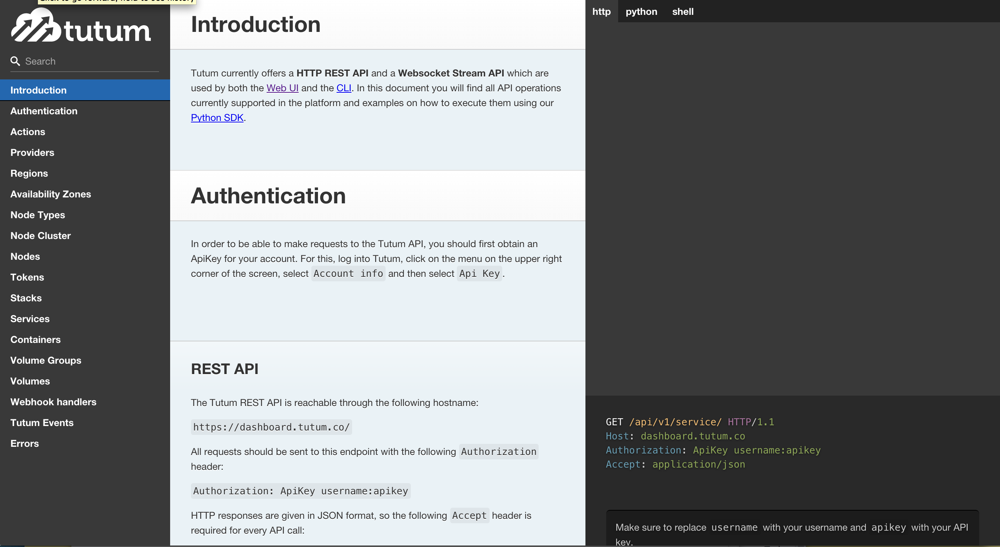

title:    RVA DevOps - Tutum
controls: false
output:   presentation.html
style:    style.css

--

# RVA DevOps: Tutum
## Build, deploy, and manage full stacks across any cloud provider

--

# About me
## Obie Quelland
## Elephant Insurance
## quelland@gmail.com
## [github.com/obieq](https://github.com/obieq)

--

# Goal: Replicate Heroku

    
    

      
    

--

# Heroku: Simple Deployments

    
    

      
    

--

# Reason: Buildpacks

    
    

      
    

--

# Gotcha: Expensive (relatively)

    
    

      
    

--

# Let's try to do the same via Tutum
## (disclaimer)

    
    

      
    

--

# Nodes

    
    

      
    

--

# Services

    
    

      
    

--

# Webhooks

    
    

      
    

--

# Respite: Runscope

    
    

      
    

--

# Demo
## heroku deploy
## tutum deploy
## scale up
## scale down
## provision nodes

--

# API

    

      
    

--

# Still Early

    

      
    

--

# Closing

## From a devops perspective, focus on the concepts vs. the implementation.
## Keep in mind, Docker is only two years old.
